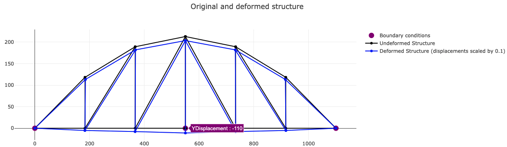
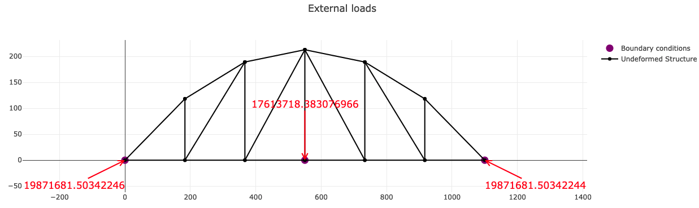

# PoliFEM

## About
Static and dynamic (modal and time history) Finite Element Solver for frames, beams and truss structures.

## Requirements
- Node.js

## Quick Start
- In root directory, execute `npm install`
- In root directory, execute `npm run start`

## Other examples
- Check examples in `src/tests/`