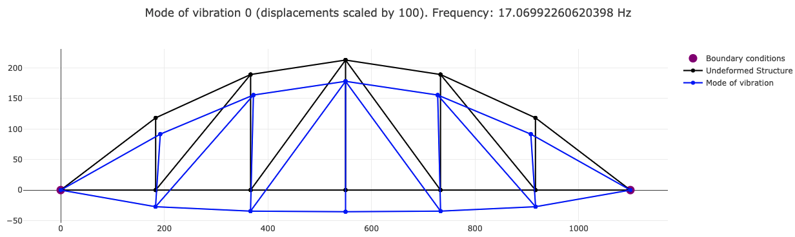

# PoliFEM

  

  

  

## About
Static and dynamic (modal, implicit time history and explicit time history) Finite Element Solver for frames, beams and truss structures. Solid elements also supported, but meshing must be done with `gmsh`

## Requirements
- Node.js

## Quick Start
- In root directory, execute `npm install`
- In root directory, execute `npm run start`

## Other examples
- Check examples in `src/tests/`

## TODO
- Docstrings
- Publish to npm
- Robust error handling